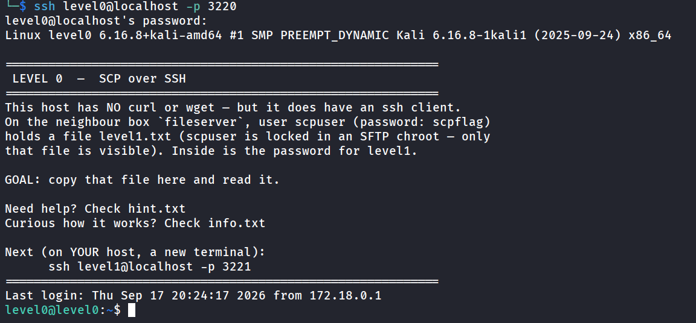

# FTW — File Transfer Wargame 🚩

An **OverTheWire-style CTF wargame** built entirely around one skill: **moving files across the
wire** — downloading, serving, exfiltrating, encoding. You SSH into a box whose toolset is
deliberately stripped down, so you must use whatever technique is left. Inside the file you
pull is the password to the next level. Made as a hands-on companion to a file-transfer video.



- **34 levels** (0–33) across **5 parts**, from `scp` to bare `/dev/tcp`, netcat, compression,
  obfuscation, and a hint-free **GHOST** hard mode.
- Each level is its own Docker container with only the tools that level teaches.
- Runs fully offline via `docker compose`. Flags are generated per run.

> 🇷🇺 **Russian version is in the [`RU/`](RU/) folder** — identical gameplay, Russian text.
> The English edition lives in [`EN/`](EN/).

---

## Quick start

```bash
cd EN                          # or: cd RU  for the Russian edition
./gen-flags.sh                 # generate flag-passwords (required once)
docker compose up -d --build   # build & launch all 35 containers
```

Then start playing from your host:

```bash
ssh level0@localhost -p 3220   # starting password: start-here
cat task.txt                   # each level's brief is always in ~/task.txt
```

Each level ships three files in your home dir: **`task.txt`** (the brief),
**`hint.txt`** (an opt-in nudge), and **`info.txt`** (a deep-dive on the tool used).


Solve the level, read the password it reveals, move on. A level's SSH port is
**`3220 + level number`** (level7 → 3227, level33 → 3253). Tear down with `docker compose down`.
Fresh flags anytime (no rebuild): `./gen-flags.sh && docker compose restart`.

---

## The five parts

| Part | Levels | Techniques |
|------|--------|------------|
| 1 · Channels              | 0–7   | scp · curl/wget · python · perl/php/ruby · gawk · /dev/tcp · netcat · tar\|nc |
| 2 · Encoding & integrity  | 8–14  | base64/nc · base32 · hex · gzip · openssl AES · ncat --ssl · sha256 |
| 3 · Exotic                | 15–19 | uuencode · XOR · split/reassemble · UDP · socat |
| 4 · Compression/encodings | 20–27 | base85 · z85 · bzip2 · xz · zlib · UTF-16 · layered basenc · octal |
| 5 · GHOST (hard)          | 28–32 | enumeration · port scan · encoding recognition · strings · XOR brute |
| Finale                    | 33    | ✓ you cleared them all |

In the **GHOST** part the `task.txt` is nearly empty — no technique, no path. You enumerate
the host yourself: what's installed, what `fileserver` is listening on, where the flag hides.

---

## Architecture

```
                 ┌──────────────┐
   you ──ssh──►  │  level0..33  │  each: minimal container, only the tools for its lesson
                 └──────┬───────┘
                        │ pulls the next password from …
                 ┌──────▼───────┐
                 │  fileserver  │  hosts every channel: HTTP, netcat/UDP/TLS, socat,
                 └──────────────┘  tar streams, SFTP source
```

fileserver exposes HTTP `:80`/`:1337`, SSH `:22` (SCP source), nc `:4445-4447`, TLS `:4448`,
UDP `:4449`, socat `:4450`, ghost `:9029`/`:9032`. Its ports are not published to the host —
reachable only from inside the levels. Flags are random per deployment (`gen-flags.sh`) and
git-ignored, so the repo never carries live passwords.

---

## Repo layout

```
.
├── README.md            # you are here
├── .gitignore           # excludes flags/ and SOLVES.md
├── EN/                  # English edition
│   ├── docker-compose.yml
│   ├── Dockerfile.level # one parametrised image for all levels
│   ├── Dockerfile.server
│   ├── gen-flags.sh     # generate flags
│   ├── level/           # level container entrypoint
│   ├── server/          # fileserver entrypoint (all channels)
│   ├── tasks/           # level briefs (level0.txt … level33.txt)
│   ├── flags/           # (git-ignored) generated passwords
│   ├── SOLVES.md        # (git-ignored) full walkthrough
│   └── README.md
└── RU/                  # Russian edition (same, Russian text)
```

Container names are prefixed `ftw_*` (EN) and `ftwru_*` (RU). Both editions use the same host
ports (3220–3253), so **run one edition at a time** — `docker compose down` one before the other.

---

## Notes

- Requires Docker + Docker Compose. ~35 containers per edition; a small box (≈2 GB RAM) is comfortable.
- The Windows techniques from the video (`certutil`, PowerShell `IWR`/`IEX`, `Get-FileHash`)
  aren't containerised (Windows containers on Linux are impractical) — they're covered in the
  companion web page instead.

---

## System requirements

Deliberately light — one edition is 35 small containers sharing a common Debian base layer.

- **OS:** Linux with Docker Engine, or macOS/Windows with Docker Desktop.
- **Docker:** Engine ≥ 20.10 and Compose v2 (the `docker compose` subcommand).
- **CPU:** any x86-64 or arm64; 1 core works, 2+ makes the first build faster.
- **RAM:** ~100 MB at idle for all 35 containers; **1 GB free is comfortable**, 2 GB recommended
  during the parallel first build.
- **Disk:** ~2–3 GB for one edition's images (shared base keeps it small); ~4–5 GB if you build
  both EN and RU.
- **Network:** internet needed only on the first `docker compose up --build` (to pull the Debian
  base + apt packages). After that it runs fully offline.
- **Ports:** binds host TCP **3220–3253** (one SSH port per level). fileserver's ports stay internal.
